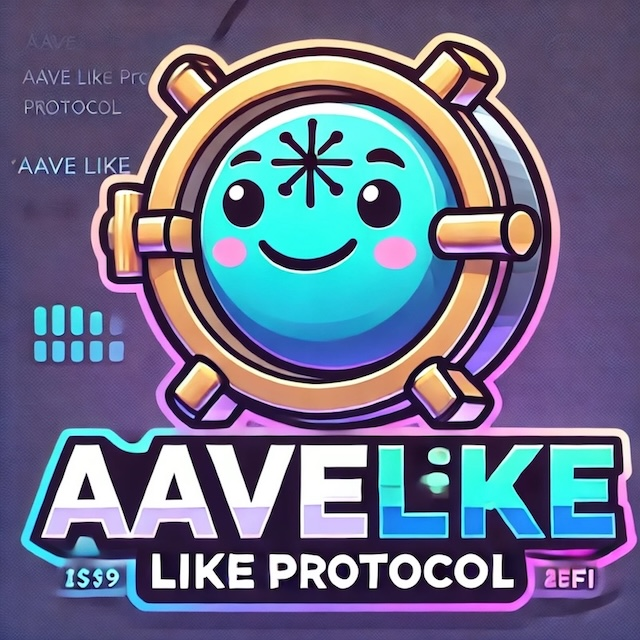

# AAVE like application

    

The DeFi space offers alternatives to every aspect of financial services, including insurance, trading, loans, and savings. 
This repository explores the concept of loan through the implementation of a lending protocol similar to AAVE. The intent 
is not to compete with established protocols but to demonstrate the main mechanisms involved in such a protocol. 

Starting a journey in the DeFi space can be challenging, so this demo application serves as an introductory step towards 
understanding DeFi and lending protocols. Before diving into the code, the following documentation will shed some lights 
on key concepts and provide you with a solid fundamentals. So without further ado, let's begin the journey.

☯️ [Lending in DeFI and TradFi: The structural difference](docs/lending-in-defi-and-tradfi.md)

🛡️ [Why is collateral needed ?](docs/why-is-collateral-needed.md)

🤔 [If You Have Collateral, why not just sell?](docs/if-you-have-collateral-why-not-just-sell.md)

🧮 [How do DeFi lending protocols calculate interest rates ?](docs/how-do-DeFi-lending-protocols-calculate-interest-rates.md)

🪙 [Tracking debt through debt tokens](docs/tracking-borrower-debt-using-token.md)

🪙 [Tracking interest through interest bearing tokens](docs/tracking-lender-interest-using-token.md)

📈 [Mitigating Collateral Price Fluctuations: Understanding Liquidation](docs/liquidation.md)

📜 [Smart Contracts for a Aave-like protocol](./smart-contracts/README.md) 

📘 [References](docs/references.md)

> [!WARNING]  
> DISCLAIMER: I am not a DeFi expert / guru. Like you, I sought to better understand the concepts by getting my hands dirty. :)