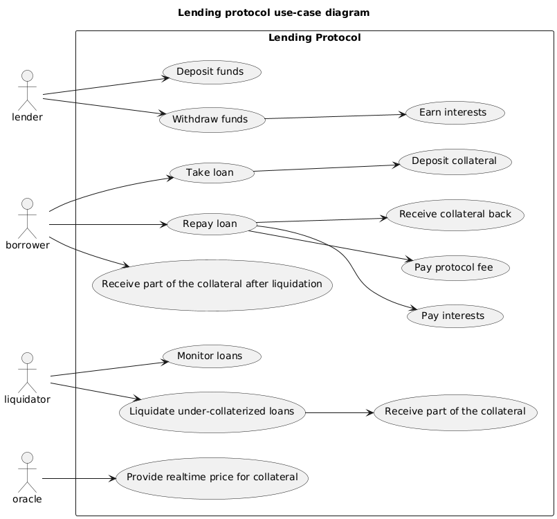

# Liquidity pool

# Interests

operates differently than traditional finance (TradFi). From
a pure structural angle, omitting the  
that relies on order book that matches individual buy and sell orders. These protocols leverage liquidity
pool where depositors can deposit assets to earn interests, while borrowers can borrow asset against a
collateral.

Interest rates within these protocols are typically determined algorithmically based on the supply and demand dynamics of the pooled assets. When the demand for borrowing increases relative to the available supply, interest rates rise to incentivize more deposits; conversely, when supply exceeds demand, interest rates decrease to encourage borrowing

Traditional Finance (TradFi) and Decentralized Finance (DeFi) represent two distinct paradigms in the financial landscape, each with unique structures, operations, and approaches to borrowing.

# Liquidator why ??

