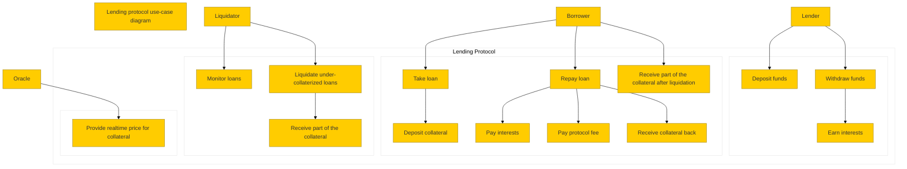

Sure! Here is the equivalent diagram using Mermaid syntax:




```
This Mermaid diagram should render correctly on GitHub and visually represent the same structure as your original PlantUML diagram.
```


# OLD

