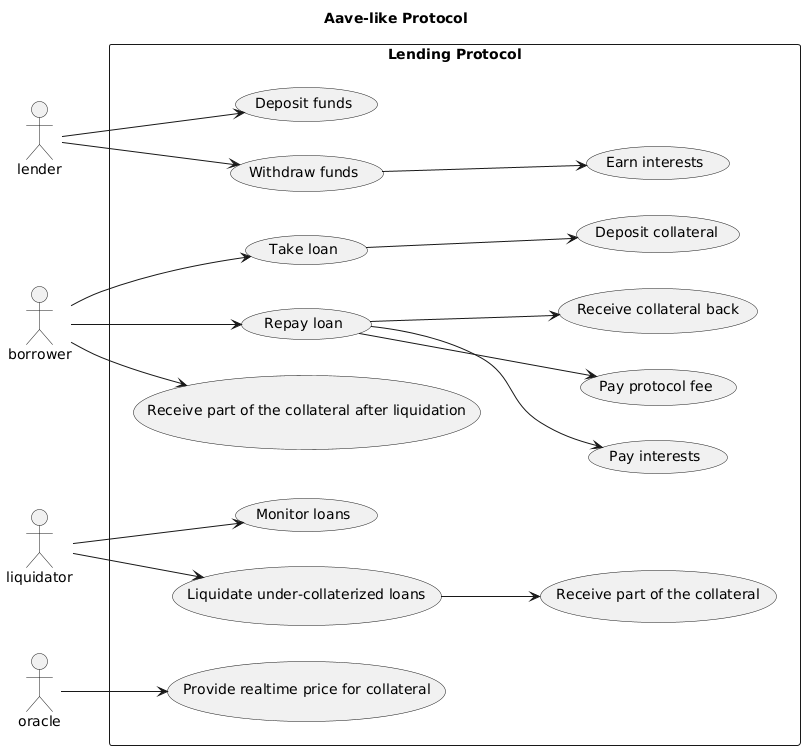

# 📜 Smart Contracts for a Aave-like protocol

This project implements a simplified version of a lending protocol similar to Aave. While 
it does not include all features (such as flash loans, governance tokens, stable rates, etc.), 
it covers most of the essential functionalities to provide a clear understanding of how 
these systems are assembled.
 
> [!WARNING]
> This project is for educational purposes only. It lacks Rule-Based Access Control (RBAC) and 
> other essential functionalities to ensure security and robustness. The primary goal is to make 
> the project and code more readable, accessible, and easy to understand. Therefore, it is not 
> intended for production use.

